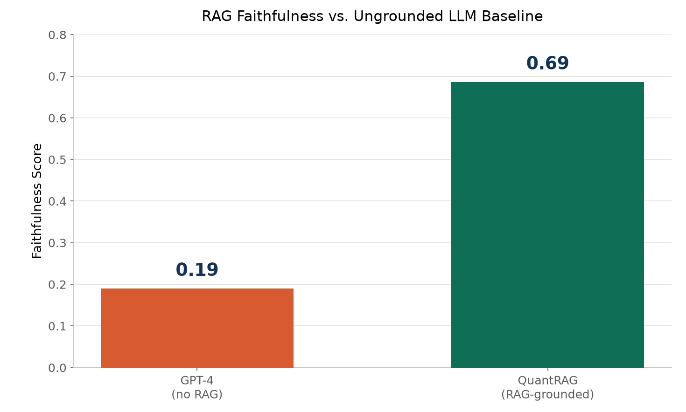
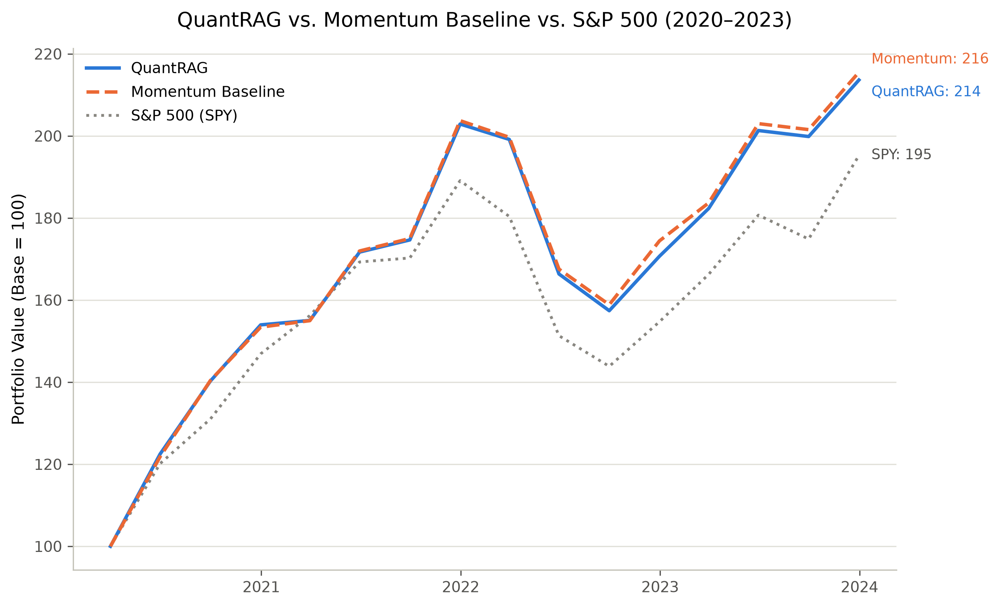

# QuantRAG

### Explainable AI-Driven Portfolio Optimisation via Retrieval-Augmented Black–Litterman

**Kevin Anand Venkatesh** (25207242) · **Harshini Margabandu**
(25209323) · University College Dublin · MSc Data and Computational
Science

[]()
[]()
[]()
[]()

------------------------------------------------------------------------

## Abstract

QuantRAG combines Retrieval-Augmented Generation with Black–Litterman
portfolio optimisation to ground investment decisions in SEC filing
evidence rather than price data alone, addressing LLMs' tendency to
hallucinate and their lack of a principled way to convert qualitative
insight into portfolio weights. A LangGraph-based agent retrieves
relevant filing evidence, extracts structured investment views via
tool-enabled LLMs, and maps confidence scores to uncertainty estimates
for Bayesian optimisation. The system is evaluated on both retrieval
faithfulness (FinanceBench) and financial performance (a point-in-time
backtest with a momentum ablation), delivering an explainable, traceable
framework for investment decision support.

------------------------------------------------------------------------

## Table of Contents

-   [The Problem](#the-problem)
-   [Motivation](#motivation-why-agentic-rag)
-   [Architecture](#architecture)
-   [Novel Contributions](#novel-contributions)
-   [Technology Stack](#technology-stack)
-   [Coverage & Scale](#coverage--scale)
-   [Results](#results)
-   [Sample Portfolio Output](#sample-portfolio-output)
-   [Key Insights](#key-insights)
-   [Engineering Challenges](#engineering-challenges)
-   [Installation](#installation)
-   [Usage](#usage)
-   [Project Structure](#project-structure)
-   [Future Work](#future-work)
-   [References](#references)

------------------------------------------------------------------------

## The Problem

Every quarter, over 10,000 SEC filings publish risk disclosures,
management outlook, and competitive insights that price-based
quantitative models entirely ignore. LLMs can read this text, but:

-   Price-only models ignore valuable textual intelligence
-   LLMs hallucinate without retrieval grounding
-   There is no principled conversion from qualitative insights to
    portfolio weights

------------------------------------------------------------------------

## Motivation: Why Agentic RAG?

-   **Grounded, not memorised** - every recommendation traces back to
    retrieved SEC filing evidence
-   **Confidence-calibrated** - model confidence maps mathematically to
    uncertainty, controlling each view's influence on the portfolio
-   **Exact where it matters** - tool-enabled retrieval pulls precise
    financial figures rather than estimating them from prose
-   **Scalable and autonomous** - the LangGraph workflow analyses
    hundreds of companies without manual intervention
-   **Explainable by design** - every decision carries evidence,
    reasoning, confidence, and filing citations

------------------------------------------------------------------------

## Architecture

### Stage A - Data Ingestion *(offline, one-time indexing)*

```         
S&P 500 (500 companies)
        │
        ▼
EDGAR 10-K filings (FY2020–2024)
        │
        ▼
Section-aware chunking (Item 1A / Item 7 / Item 7A)
        │
        ▼
chunks.jsonl (local export, deterministic UUID5 IDs)
        │
        ▼
Google Colab (T4 GPU) - BGE-large-en-v1.5 embeddings (1024-d)
        │
        ▼
Qdrant - 281,784 indexed chunks
(payload indexed on ticker · year · section)
```

### Node A - Retrieval

```         
Query → BGE embedding → Top-20 (Qdrant search) → Cross-Encoder reranking
      → Jaccard diversity filter → Top-5 cited evidence
```

### Node B - View Extraction

```         
Claude (tool-use) → get_financial_metric (exact figures)
      → structured investment view → confidence calibration
      → validation / retry loop

View = { direction, magnitude, confidence, reasoning, citation }
```

### Node C - Portfolio Optimisation

```         
Ledoit-Wolf covariance (Σ)   Market prior (π = λΣw)
              │                       │
              └──────────┬────────────┘
                         ▼
        LLM views (P, Q matrices) + Confidence → Ω
                         │
                         ▼
              Black–Litterman posterior (μ_BL)
                         │
                         ▼
          cvxpy optimiser:  max μ'w − λw'Σw
          s.t.  Σw = 1,  0 ≤ w ≤ max_weight
```

### Node D - Report Generation

```         
Portfolio Weights + Reasoning + Confidence + Citations → Final Report
```

------------------------------------------------------------------------

## Novel Contributions

### 1. RAG-Grounded Views

Unlike prior Black–Litterman approaches using price momentum, QuantRAG
generates every view from retrieved, cited SEC filing evidence -
transparent and auditable by design.

### 2. Confidence → Ω Mapping

$$\Omega_i = \frac{1 - \text{confidence}_i}{\text{confidence}_i}$$

Higher confidence yields smaller Ω, giving that view stronger pull on
the posterior; uncertain views stay closer to market equilibrium. This
is the project's core original mathematical contribution - a direct
bridge between an LLM's self-reported certainty and Black–Litterman's
uncertainty parameter.

### 3. Section-aware Chunking

Filings are segmented by official SEC sections (Item 1A, 7, 7A) rather
than fixed token windows, improving retrieval quality and cutting
irrelevant context.

### 4. Dual Evaluation

Retrieval quality and portfolio performance are evaluated independently.
A controlled momentum ablation isolates RAG's specific contribution,
holding the optimiser and constraints fixed.

------------------------------------------------------------------------

## Technology Stack

| Component | Technology |
|------------------------------------|------------------------------------|
| Agent Orchestration | LangGraph (4-node stateful agent) |
| View Extraction | Claude (Tool Use, Structured Output, Haiku → Sonnet Fallback) |
| Embeddings | BGE-large-en-v1.5 (1024 dimensions) |
| Vector Database | Qdrant (281,784 indexed chunks) |
| Reranking | Cross-Encoder (ms-marco-MiniLM-L6-v2) |
| Diversity Filter | Jaccard Word-Overlap Deduplication |
| Portfolio Optimisation | cvxpy (OSQP / ECOS / SCS solvers) |
| Covariance Estimation | Ledoit-Wolf Shrinkage (scikit-learn) |
| Financial Data | yfinance (structured statement extraction) |
| Ingestion Compute | Google Colab (T4 GPU, CUDA/MPS/CPU auto-detect) |
| Demo Interface | Gradio |

------------------------------------------------------------------------

## Coverage & Scale

| Metric                             | Value               |
|------------------------------------|---------------------|
| S&P 500 tickers attempted          | 500                 |
| Successfully indexed               | **465 / 500 (93%)** |
| Filing text chunks                 | 281,784             |
| 10-K filings processed (2020–2024) | 2,326               |
| FinanceBench questions evaluated   | 110 / 150           |
| Tickers in backtest universe       | 20                  |

------------------------------------------------------------------------

## Results

### Faithfulness - FinanceBench Evaluation

| Metric           | QuantRAG   | Baseline GPT-4 (No RAG) | Result            |
|------------------|------------|-------------------------|-------------------|
| **Faithfulness** | **0.6864** | 0.19                    | **3.6× baseline** |

> **Interpretation:** A 3.6× improvement in faithfulness confirms that
> retrieval grounding substantially reduces hallucination compared to an
> ungrounded LLM answering from memory alone.

{width="679"}

------------------------------------------------------------------------

### Backtest Performance - 16-Quarter Point-in-Time Simulation (2020–2023)

| Strategy | Total Return | Annualised Return | Sharpe Ratio | Max Drawdown | Alpha vs SPY |
|------------|------------|------------|------------|------------|------------|
| **QuantRAG** | 113.63% | 22.44% | 1.063 | −22.42% | 2.70% |
| **Momentum Baseline** | 115.53% | 22.73% | 1.082 | −22.02% | 2.92% |
| **S&P 500 (SPY)** | 95.24% | 19.53% | 0.984 | −23.93% | \- |

*Universe: 20 S&P 500 tickers. Rebalanced quarterly. Point-in-time
correct - only filings realistically available by each rebalancing date
are used.*

**Equity Curve (Base = 100):**

{width="689"}

### Robustness Check - Covariance Method Comparison

| Method | QuantRAG Return | Momentum Return | Difference |
|------------------|------------------|------------------|------------------|
| Raw Sample Covariance | 109.75% | 109.70% | +0.05 pts (QuantRAG) |
| **Ledoit-Wolf Shrinkage** *(primary)* | **113.63%** | **115.53%** | −1.90 pts (Momentum) |

> **Interpretation:** Both methods agree qualitatively - QuantRAG and
> Momentum perform comparably, both clearly ahead of SPY. Ledoit-Wolf is
> reported as the primary result per standard portfolio theory practice
> (Ledoit & Wolf, 2004), given its established superiority over raw
> sample covariance for covariance matrices of this dimension relative
> to the sample size available. The consistency across both methods
> indicates the RAG-vs-momentum finding is not an artifact of covariance
> estimation noise.

------------------------------------------------------------------------

## Sample Portfolio Output

> **NVDA - 20.00%** · Neutral (+2.0%, confidence 62%) Strong financial
> fundamentals, including 56.9% gross margins, \$5.64B operating cash
> flow and a \$13.3B cash position, support the outlook. However, the
> FY2023 10-K identifies material risks around demand forecasting and
> third-party supply-chain dependencies, limiting conviction. *Evidence:
> NVIDIA CORP (NVDA) 10-K FY2023, Item 1A - Risk Factors.*

> **META - 8.26%** · Bullish (+12.0%, confidence 68%) FY2024 results
> show strong operational recovery, with 60% net income growth and 22%
> revenue acceleration. Despite regulatory, competitive and
> metaverse-related risks disclosed in its filings, the evidence
> supports expected outperformance. *Evidence: Meta Platforms 10-K
> FY2024, FY2023 and FY2022 Risk Factors; FY2024 financial statements.*

**Traceability:** every view is traceable to specific filing evidence
and, where used, exact structured financial figures - not inferred or
hallucinated.

------------------------------------------------------------------------

## Key Insights

-   **3.6× higher faithfulness** - QuantRAG substantially outperforms an
    ungrounded LLM baseline on FinanceBench, showing retrieval grounding
    reduces hallucination
-   **Strong performance vs. SPY** - QuantRAG and momentum-driven
    Black–Litterman both substantially outperformed the S&P 500
    (2020–2023)
-   **RAG vs. momentum** - RAG-grounded views didn't separate from price
    momentum in this trending regime, confirmed under two covariance
    methods
-   **Conservative behaviour** - the system declines to answer ratio
    questions absent from retrieved text, explaining lower
    precision/recall as a feature, not a defect
-   **Confidence calibration** - strong quantitative evidence drives
    higher confidence and portfolio influence; weak evidence stays
    cautious and near-neutral

------------------------------------------------------------------------

## Engineering Challenges

1.  **Non-standard SEC filing structures** - 38/503 companies (7.6%) use
    filing formats incompatible with standard section extraction;
    root-caused rather than force-fixed to avoid regressing the 465
    working companies
2.  **Payload indexing for efficient vector search** - filtered vector
    search silently returned empty results without an explicit Qdrant
    payload index on `ticker`/`year`/`section`
3.  **Point-in-time backtesting discipline** - the backtest strictly
    enforces that only filings realistically available by each simulated
    date are used, preventing look-ahead bias
4.  **Crash-resilient caching** - per-ticker disk-backed view caching
    ensures a mid-run failure never discards already-completed,
    already-paid-for API work

------------------------------------------------------------------------

## Installation

### Prerequisites

-   Python 3.11
-   Docker (for Qdrant)
-   API keys: Anthropic (Claude), optionally Groq

### Setup

``` bash
git clone <repo-url>
cd quantrag

# Install dependencies
uv sync

# Start Qdrant
docker run -d --name qdrant_quantrag -p 6333:6333 \
  -v $(pwd)/qdrant_storage:/qdrant/storage qdrant/qdrant

# Configure environment
cp .env.example .env
# edit .env - add ANTHROPIC_API_KEY, GROQ_API_KEY, LLM_PROVIDER=anthropic
```

------------------------------------------------------------------------

## Usage

### Build the index (first time only)

``` bash
python scripts/get_sp500_tickers.py
python scripts/export_chunks.py            # fetch + chunk (local)
# → upload chunks.jsonl to notebooks/quantrag_embed_colab.ipynb, run on GPU
python scripts/import_embeddings.py        # import embeddings (local)
```

### Run the agent on a portfolio

``` bash
python main_phase3.py
```

### Run the FinanceBench evaluation

``` bash
python scripts/run_eval.py
```

### Run the historical backtest

``` python
from src.evaluation.backtest import run_backtest

result = run_backtest(
    tickers=["AAPL", "MSFT", "NVDA", ...],
    start="2020-01-01", end="2023-12-31",
)
```

### Launch the demo

``` bash
python app.py
# → http://localhost:7860
```

------------------------------------------------------------------------

## Project Structure

```         
quantrag/
├── src/
│   ├── ingestion/          # EDGAR fetching, section-aware chunking
│   ├── retrieval/          # Embedding, Qdrant, reranking, diversity filter
│   ├── agent/               # LangGraph nodes, tools, graph wiring
│   ├── optimizer/           # Black-Litterman + Ledoit-Wolf
│   ├── evaluation/          # FinanceBench eval, backtest, momentum baseline
│   └── device.py            # Hardware auto-detection (CUDA/MPS/CPU)
├── scripts/                 # Ticker fetch, chunk export/import, eval runner
├── notebooks/                # Colab GPU embedding notebook
├── outputs/phase4_backtest/  # Saved equity curves, reports, figures
├── main_phase3.py            # Agent runner
├── app.py                    # Gradio demo
└── docs/                     # Phase handover documents, poster
```

------------------------------------------------------------------------

## Future Work

1.  **Temporal granularity** - incorporate quarterly earnings
    transcripts for more timely views
2.  **Market regimes** - evaluate less-trending periods (2015–2018, 2022
    bear market) where fundamentals may diverge more from momentum
3.  **Structured financial data** - extend XBRL extraction to close the
    quantitative-ratio gap found in FinanceBench
4.  **Scale** - expand to the full 465-company index at monthly
    rebalancing to test scalability and turnover sensitivity
5.  **Explainability** - add attribution/attention visualisation over
    retrieved passages

------------------------------------------------------------------------

## References

1.  Lewis, P. et al. (2020). *Retrieval-Augmented Generation for
    Knowledge-Intensive NLP Tasks.* NeurIPS.
2.  Yao, S. et al. (2022). *ReAct: Synergizing Reasoning and Acting in
    Language Models.* ICLR.
3.  Islam, P. et al. (2023). *FinanceBench: A New Benchmark for
    Financial Question Answering.* arXiv:2311.11944.
4.  Lee, J. et al. (2025). *Enhancing Black-Litterman Portfolio Views
    with Large Language Models.* arXiv:2504.14345.
5.  Black, F. & Litterman, R. (1992). *Portfolio Optimization.*
    Financial Analysts Journal.
6.  Ledoit, O. & Wolf, M. (2004). *Honey, I Shrunk the Sample Covariance
    Matrix.* Journal of Portfolio Management.

------------------------------------------------------------------------

## Authors

**Kevin Anand Venkatesh** (25207242) · **Harshini Margabandu**
(25209323) MSc Data and Computational Science, University College Dublin
